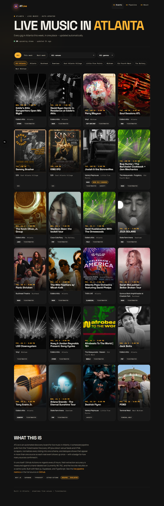
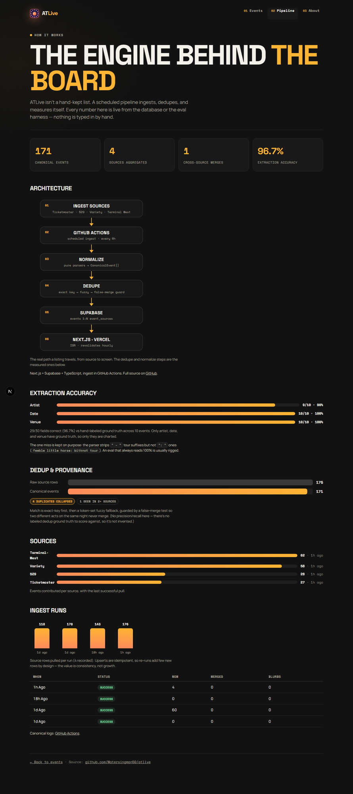

# ATLive

**Every gig in Atlanta this week, in one place — updated automatically.**

A live board of live-music shows across Atlanta. Poster-style listings you can
filter by date, venue, neighborhood, and genre — and it keeps itself current, so
nobody maintains a list by hand.

🔗 **Live:** https://atlive.vercel.app



---

## How it works

The board is the easy part. Underneath is a self-running, multi-source ingestion
pipeline with provenance-preserving dedup, a measured extraction eval, and a live
data-quality dashboard at [`/pipeline`](https://atlive.vercel.app/pipeline).



**The flow:** four sources → GitHub Actions cron (every 6h) → normalize → dedupe →
Supabase → Next.js site (ISR). No Vercel cron — ingestion runs in Actions to dodge
the serverless execution-time limit.

### What it demonstrates

- **Multi-source ingestion** through one `SourceAdapter` interface — a clean API
  source (Ticketmaster Discovery), a static-HTML scrape (529), and AEG JSON feeds
  (Variety Playhouse, Terminal West).
- **Provenance-preserving dedup.** One canonical `events` row per real show, with
  every source linked in `event_sources` — so a show seen on Ticketmaster *and*
  Variety merges into one card that says "seen in 2 sources." Exact-key match with a
  token-set fuzzy fallback, and a **false-merge guard test** so two different acts on
  the same night never merge.
- **A measured eval, not vibes.** The extraction step is scored against hand-labeled
  ground truth — see below — and the `/pipeline` page charts the same numbers live.
- **Runs itself.** GitHub Actions ingests every 6h; the site serves cached data via
  ISR and never goes blank (last-good render + freshness banner); failed runs open an
  issue. A weekly Resend email digest goes out Monday mornings.
- **AI, done honestly.** A `claude-haiku-4-5` blurb per event, generated once and
  stored, with a graceful skip on failure — and the eval targets the *extractable*
  step (real ground truth), not blurb taste.

### Eval results

`npm run eval` scores artist/date/venue extraction from captured raw fixtures against
`eval/labels.ts` (hand-labeled ground truth), and writes `eval/results.json` (which
the `/pipeline` page imports — the number on the site is the number the harness
computes):

```
Extraction accuracy: 29/30 fields correct (96.7%) across 10 labeled events
Per field: artist 9/10  ·  date 10/10  ·  venue 10/10
Misses:
  - variety:1458556  artist: expected "feeble little horse", got "feeble little horse: bitknot tour"
```

The one miss is real and kept on purpose: the parser strips `" - "` tour suffixes but
not `": "` ones. An eval that always reads 100% is usually rigged — this one surfaces
actual extraction edge cases and guards against regressions.

### Tech stack

Next.js 16 (App Router, ISR) · React 19 · TypeScript · Supabase (Postgres) ·
Ticketmaster Discovery API · cheerio · Anthropic SDK (claude-haiku-4-5) ·
Framer Motion · Resend · Vercel (hosting + Analytics) · GitHub Actions (scheduled
ingest + weekly digest).

### Project layout

```
app/                    Next.js site (server page → client EventsBoard)
app/pipeline/           data-quality dashboard (hand-built SVG/CSS charts)
app/[slug]/             neighborhood + genre SEO landing pages (static, ISR)
src/lib/sources/        SourceAdapter implementations (+ pure parsers)
src/lib/dedup.ts        fuzzy matcher (+ dedup.test.ts)
src/lib/db.ts           idempotent upsert with exact→fuzzy dedup
src/lib/neighborhoods.ts venue → Atlanta neighborhood map
src/lib/landing.ts      landing-page config + match logic (keyword map plugs in here)
src/lib/extraction-eval.ts  shared eval scorer (CLI + site)
src/ingest/run.ts       ingest entrypoint (runs in GitHub Actions)
src/digest/send.ts      weekly email digest (Resend)
src/social/             weekly auto-post (Bluesky/X) + IG/Reddit draft pack
supabase/migrations/    schema + pipeline_stats() RPC
eval/                   extraction-accuracy harness + labeled fixtures
```

### Scripts

| Command | What it does |
|---|---|
| `npm run dev` | Next.js dev server |
| `npm run ingest` | Fetch all sources → dedupe → upsert → blurbs (the cron job) |
| `npm run ingest:dry` | Fetch + normalize, print sample, no DB writes |
| `npm run db:apply` | Apply the schema migration |
| `npm run digest` | Send the weekly email digest |
| `npm run draftpack` | Build the IG + Reddit draft pack (writes `drafts/`, emails owner) |
| `npm run social` | Auto-post the weekly lineup to Bluesky + X (no-op without keys) |
| `npm test` | Pure-logic tests: dedup guard, landing match, social copy, OAuth signing |
| `npm run eval` | Extraction-accuracy eval (prints the number above) |
| `npm run typecheck` | `tsc --noEmit` |
| `npm run build` | Production build |

### Local dev

```bash
npm install
cp .env.example .env.local   # fill TM_API_KEY, SUPABASE_*; ANTHROPIC_API_KEY optional
npm run ingest:dry           # see real Ticketmaster data with no DB
# with Supabase configured:
npm run db:apply && npm run ingest && npm run dev
```

### Deployment

- **Ingestion** runs in GitHub Actions (`.github/workflows/ingest.yml`) on a 6h cron.
  Secrets: `TM_API_KEY`, `SUPABASE_URL`, `SUPABASE_SERVICE_ROLE_KEY`,
  `ANTHROPIC_API_KEY`. The weekly digest (`digest.yml`) adds `RESEND_API_KEY` +
  `DIGEST_TO`.
- **Growth** runs in `social.yml` (weekly): auto-posts the lineup to Bluesky + X
  (per-platform keys, optional) and emails the IG/Reddit draft pack for manual
  posting. Every platform is a no-op until its keys are set.
- **Site** deploys to Vercel and reads Supabase server-side with ISR (revalidate 1h).
  Custom domain = set `NEXT_PUBLIC_SITE_URL` (canonicals, sitemap, OG, email links all follow).

## Status

- [x] Multi-source ingestion (Ticketmaster + 529 + Variety + Terminal West) via `SourceAdapter`
- [x] Canonical `events` + `event_sources` schema, idempotent upsert
- [x] Dedup: exact key + fuzzy fallback + false-merge guard test
- [x] Extraction-accuracy eval (96.7%), charted live on `/pipeline`
- [x] Next.js site: poster cards, date/venue/neighborhood/genre filters, never-empty + freshness
- [x] `/pipeline` data-quality dashboard (architecture + real-data charts)
- [x] Scheduled ingest in CI, with failure alerting
- [x] Weekly email digest (Resend)
- [x] SEO: JSON-LD, sitemap, canonical tags + neighborhood/genre landing pages
- [x] Newsletter: double opt-in signup → confirmed-subscriber digest
- [x] Growth automation: weekly Bluesky/X auto-post + IG/Reddit draft pack
- [~] AI blurbs (claude-haiku-4-5) — code complete; activates when API credits are added
